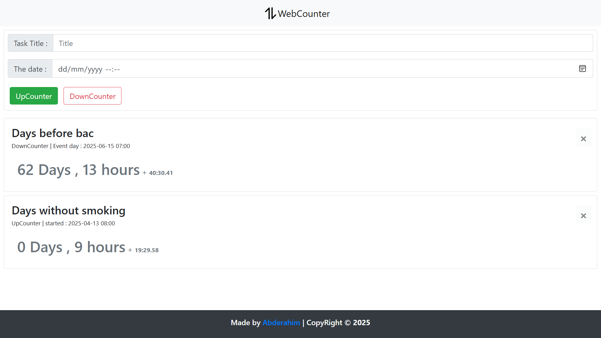

# TimeCounter

# Brief Description :
A web tool that helps you set either a countdown or count-up timer as a challenge
achieve something or while waiting for a special event.

# Overview :



### 📦 Installation

```bash
git clone https://github.com/your-username/time-counter.git
cd time-counter
start index.html
```

## 🌐 Useful Links

- 🔗 [Live Demo](https://time-counter.netlify.app)
- 📁 [GitHub Repository](https://github.com/ita27rmp100/time-counter)
- 📁 [Linkedin Post](https://www.linkedin.com/in/tayeb-abderahim-ismail/)